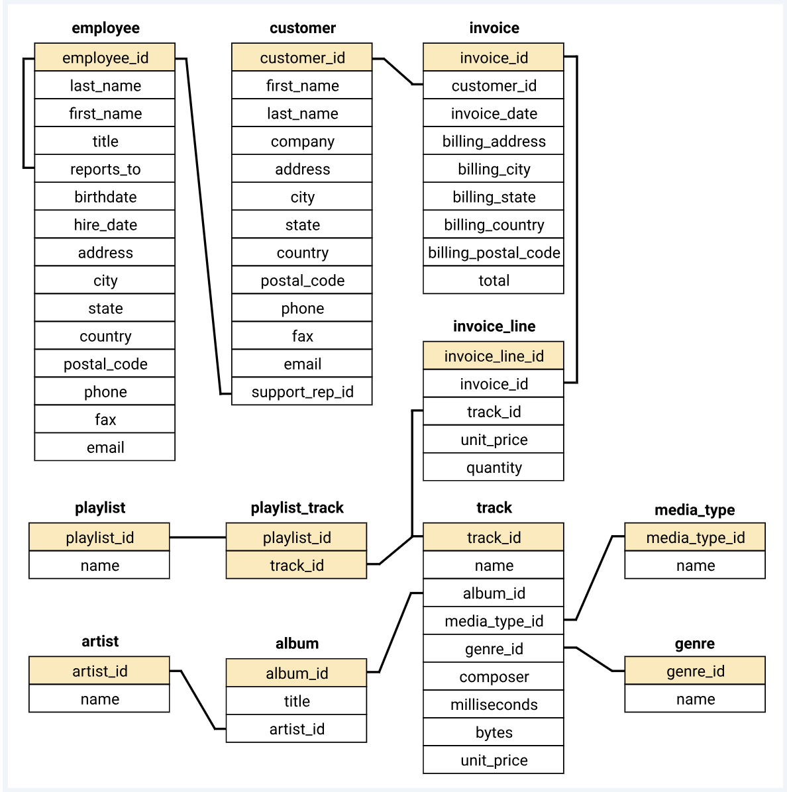

# 🎶 SQL Music Store Analysis Project

This project features a comprehensive SQL analysis using a sample **Music Store database**. It includes 11 interview-focused queries, a schema diagram, output snapshots, and in-depth explanations for each solution.

---

## 📁 Project Structure

- `music_store_queries.sql` – All 11 SQL queries used in this project.
- `music_store_query_solve.pdf` – Screenshots of query results with explanations.
- `schema_diagram.png` – Entity Relationship Diagram of the Music Store database.
- `README.md` – Project overview and documentation.

---

## 🧠 Key Questions Answered

This project solves real business problems such as:

1. Who is the senior-most employee?
2. Which countries generate the most revenue?
3. Who are our most valuable customers?
4. Which genre is most popular in each country?
5. Who are the top Rock artists by track count?
6. And more…

All solutions are written in **PostgreSQL** and use advanced SQL concepts such as:
- Joins
- Aggregations
- CTEs
- Subqueries
- Window Functions
- Filtering and Grouping

---

## 🗺️ Database Schema

> The schema includes tables like `customer`, `invoice`, `invoice_line`, `track`, `album`, `artist`, and `genre`.

---

## 📌 Interview-Focused Queries

The last 3 queries in this project simulate **real-world SQL interview scenarios**, such as:
- Identifying top-spending customers by country
- Most popular genre by region
- Revenue breakdown per artist

---

## 🚀 Skills Demonstrated

- SQL Query Optimization
- Business Problem Solving using Data
- Analytical Thinking
- Data Cleaning and Aggregation
- Schema Understanding and Relational Joins

---

## 🛠 Tools Used

- PostgreSQL
- pgAdmin
- SQL
- Git & GitHub

---

## 📥 How to Use

1. Clone or download the repository.
2. Open the `.sql` file in any PostgreSQL environment.
3. Run queries against the sample Music Store database.
4. View explanations and outputs in the PDF file.

---

## 🔖 Keywords

`SQL` `PostgreSQL` `Data Analytics` `Interview Preparation` `CTE` `Window Functions` `Music Store Database` `Business Intelligence` `Rock Music Analysis` `Top Customers SQL`

